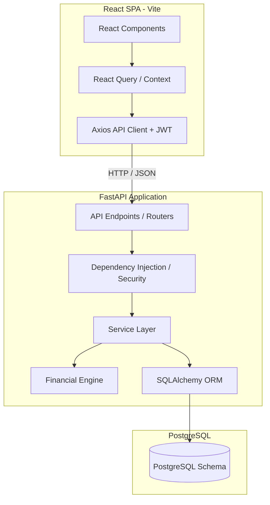
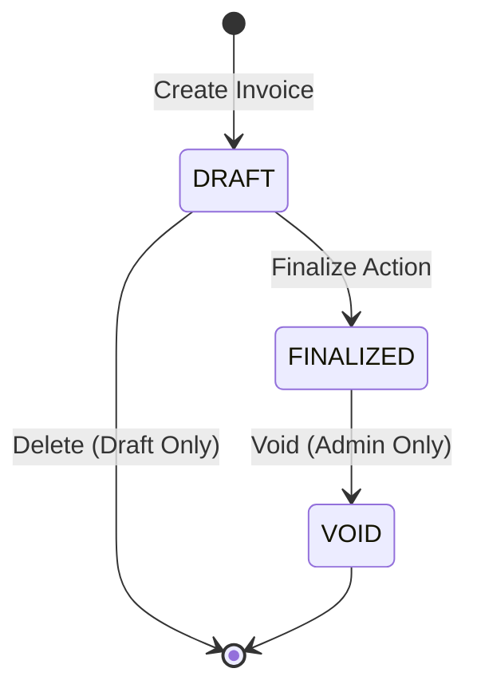
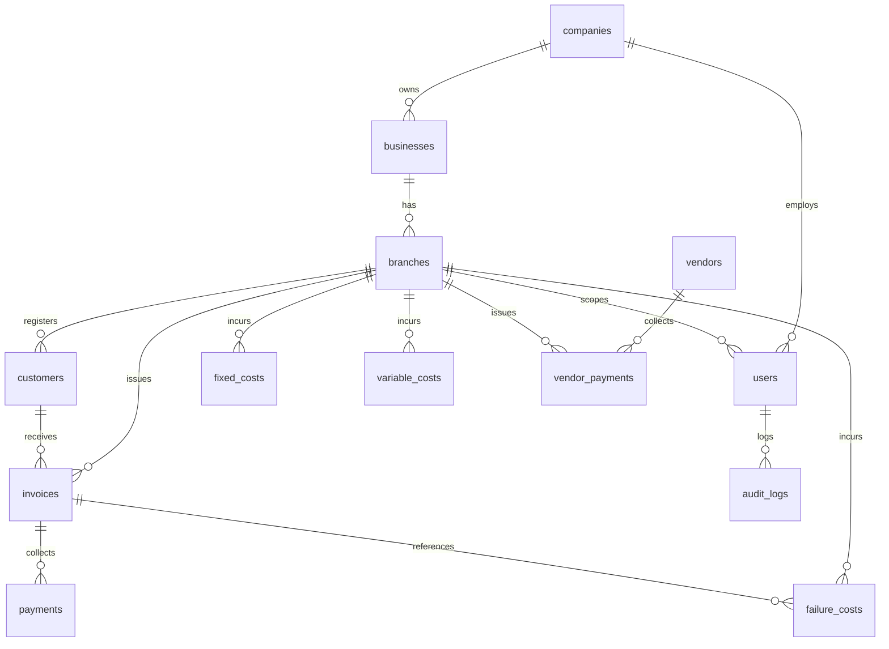

# FinTech Management System - Complete Project Handover Package

This document serves as the official project handover package for the FinTech Management System, prepared by the outgoing engineering intern. It contains three comprehensive deliverables:

1. **DELIVERABLE 1**: Knowledge Transfer (KT) Document
2. **DELIVERABLE 2**: Presentation Script (10–15 Minutes)
3. **DELIVERABLE 3**: PowerPoint Slide Content (12 Slides)

---

# DELIVERABLE 1: KNOWLEDGE TRANSFER (KT) DOCUMENT

## 1. Project Overview and Objectives
The **FinTech Management System** is a lightweight, multi-tenant financial operations portal designed specifically for retail, Point of Sale (POS), and multi-branch service businesses. 

### Core Context
In small-to-medium enterprises (SMEs) operating across multiple businesses or branches, financial visibility is often fragmented. Business owners and executives need a consolidated view of gross sales, margins, operational costs (both fixed and variable), and cash collections. However, standard Enterprise Resource Planning (ERP) systems are complex, expensive, and fail to provide strict branch-level data isolation for branch managers while offering rolled-up insights for business managers and owners.

### Project Objectives
*   **Hierarchical Scoped Access**: Provide branch-level isolation for transactions while offering rollups for business units and company-wide consolidated analytics.
*   **Deterministic Financial Modeling**: Ensure absolute accuracy in financial metrics (sales, gross profit, cost of goods sold, fixed costs, variable costs, failure costs, net profit, margins) using exact decimal calculations to prevent floating-point rounding errors.
*   **Invoicing & Payment Lifecycle**: Streamline Point of Sale sales invoice entries, bulk imports, and tracking of customer cash collections (Accounts Receivable) and vendor payments (Accounts Payable).
*   **Operational Cost Auditing**: Record, categorize, and track operational overheads—especially failure costs (e.g., product returns, shipping issues, scrap)—and tie them back to specific branches and transactions to highlight leakage.
*   **Auditability & Governance**: Log every critical modification (e.g., changes to invoice states, cost deletion) to secure the financial history of the company.

---

## 2. System Architecture and Design
The application is built as a modular monorepo, separating concerns between a responsive frontend user interface and a robust API backend.



### Backend Architecture
The backend is powered by **FastAPI** and structured around clean architecture principles:
1.  **API Layer (`app/api/`)**: Defines the HTTP routing endpoints, request schemas, and tags.
2.  **Dependency Injection (`app/api/deps.py`)**: Resolves system database sessions, extracts and validates JWT tokens, and enforces role-based access control (RBAC).
3.  **Service Layer (`app/services/`)**: Implements business rules, filters data queries according to user scopes, handles transactions, and logs audit events.
4.  **Financial Engine (`app/services/financial_engine.py`)**: A utility module dedicated to money arithmetic. It uses Python's `Decimal` type to calculate COGS, gross margins, cash balances, and net profits.
5.  **Repository/ORM Layer (`app/models/entities.py`)**: Uses **SQLAlchemy** to interface with the database.

### Frontend Architecture
The frontend is a **React** Single Page Application (SPA) bundled with **Vite**:
*   **Routing**: Handled declaratively with path-based components.
*   **Authentication & Guards**: Custom hooks check for the presence of a JWT and decode roles to show/hide pages using a `<RoleGuard>` wrapper.
*   **State Management**: React Query (`@tanstack/react-query`) handles asynchronous server cache states, invalidation, and background synchronization.
*   **UI Components**: Designed using Tailwind CSS and Radix UI primitives.

### Strict Tenancy & Financial Data Isolation
Data isolation is enforced at the database level by dynamically injecting user scopes. The system recognizes four roles:
*   **Owner / Admin**: Unrestricted global scope. Can view and modify records across all companies, businesses, and branches.
*   **Business Manager**: Scoped to a specific `business_id`. The backend automatically appends queries with business-scope filters, preventing access to sister businesses.
*   **Branch Manager**: Scoped to a specific `branch_id`. They can only view and manage invoices, customers, payments, and costs belonging to their assigned branch.

### Invoice Lifecycle State Machine
To guarantee auditability, invoices cannot be modified after they are finalized:


*   **DRAFT**: Editable. Sales amount, gross profit, date, and customer can be modified. Can be deleted.
*   **FINALIZED**: Non-editable. Invoiced values lock in and register in financial reports. Payments can only be logged against finalized invoices.
*   **VOID**: Inactive. Used to cancel finalized invoices. Voiding preserves the record for audit logs but subtracts its values from reporting totals.

---

## 3. Technologies and Tools Used
### Backend Stack
*   **Python 3.13**: Primary language runtime.
*   **FastAPI 0.111+**: High-performance async web framework.
*   **SQLAlchemy 2.0+**: Modern SQL toolkit and object-relational mapper.
*   **PostgreSQL 16**: Relational database.
*   **Uvicorn**: ASGI web server implementation.
*   **Pytest**: Test runner.
*   **Passlib (bcrypt)**: Password hashing.
*   **PyJWT**: JSON Web Token creation and verification.

### Frontend Stack
*   **React 18**: Frontend UI library.
*   **TypeScript 5**: Structural static typing.
*   **Vite 5**: Fast development server and bundler.
*   **Tailwind CSS v3**: Utility-first CSS styling.
*   **Lucide React**: Vector icons.
*   **React Hook Form & Zod**: Form state validation and type inference.
*   **React Query**: Asynchronous API cache management.
*   **Recharts**: Interactive SVG charts (revenue, costs, business comparison).
*   **SheetJS (XLSX)**: Client-side Excel parsing for bulk invoice imports.
*   **Sonner**: Toast notifications.

### DevOps & Tools
*   **Docker & Docker Compose**: Multi-container containerization (Database, API, Frontend).
*   **GNU Make**: Unified automation script (`Makefile`) to streamline local command execution.

---

## 4. Source Code Structure
```text
fintech-management-system/
├── Makefile                        # Dev commands automation script
├── docker-compose.yml              # Docker container setup (db, backend, frontend)
├── backend/                        # Backend FastAPI Monolith
│   ├── Dockerfile
│   ├── requirements.txt            # Python dependencies
│   ├── app/
│   │   ├── main.py                 # FastAPI application entrypoint
│   │   ├── api/
│   │   │   ├── deps.py             # Security, DB session, & RBAC dependency injection
│   │   │   └── v1/
│   │   │       ├── api.py          # Master router registration
│   │   │       └── endpoints/      # API Route controllers (auth, invoices, costs, etc.)
│   │   ├── core/
│   │   │   ├── config.py           # Environment variables configuration
│   │   │   └── security.py         # Password hash and JWT utils
│   │   ├── models/
│   │   │   ├── entities.py         # SQLAlchemy Database models
│   │   │   └── enums.py            # Shared python Enums (UserRole, InvoiceStatus, etc.)
│   │   ├── schemas/                # Pydantic schemas (Request/Response validation models)
│   │   └── services/               # Core business services (dashboard, report compile)
│   │       └── financial_engine.py # Deterministic money calculations
│   └── tests/                      # Pytest unit & integration test files
└── frontend/                       # Frontend Vite-React SPA
    ├── Dockerfile
    ├── package.json                # npm dependencies
    ├── tailwind.config.js          # Tailwind CSS styles config
    ├── vite.config.ts              # Vite compiler config
    └── src/
        ├── App.tsx                 # Main application shell and routing
        ├── main.tsx                # Client entry script
        ├── components/             # Reusable UI widgets (Layouts, Page headers, Badges)
        ├── lib/
        │   ├── api.py              # Axios instance configuration with JWT auto-inject
        │   ├── format.ts           # Number/currency formatting utilities
        │   └── types.ts            # Shared TypeScript type definitions
        └── features/               # Domain-driven features pages and components
            ├── auth/               # Login components
            ├── dashboard/          # Metrics cards and Recharts trends
            ├── invoices/           # Invoice management and Excel imports
            ├── reports/            # Income statements & cash flow tables
            ├── payments/           # Customer collection logs
            ├── costs/              # Cost entries (fixed, variable, failure)
            ├── vendors/            # Vendor registration
            ├── vendor_payments/    # Vendor AP collection logs
            └── admin/              # User management & audit logs viewer
```

---

## 5. Installation and Setup Instructions

### Local Environment Setup (Bare Metal)
Ensure you have **Python 3.13**, **Node.js 20+**, **Docker Desktop** (running), and **Git** installed.

1.  **Clone the Repository**:
    ```bash
    git clone https://github.com/pranav281105/Playground.git
    cd Playground/fintech-management-system
    ```
2.  **Install Dependencies**:
    ```bash
    make install
    ```
    *This creates a Python virtual environment at `backend/.venv`, installs pip packages, and runs `npm install` in the `frontend` directory.*
3.  **Launch the Full Stack**:
    ```bash
    make dev
    ```
    *This starts the PostgreSQL database in Docker, the FastAPI server on `http://localhost:8000`, and the Vite UI on `http://localhost:5173`.*

### Docker-Only Quick Start (Containerized)
To spin up the entire application inside Docker containers with a single command (perfect for review on different systems):
```bash
make docker-up
```
*To stop the containers:*
```bash
make docker-down
```
*To inspect container execution logs:*
```bash
make docker-logs
```

### Running Tests and Quality Checks
*   **Run Backend Tests (Pytest)**:
    ```bash
    cd backend
    source .venv/bin/activate
    pytest -q
    ```
*   **Run Frontend Linter**:
    ```bash
    cd frontend
    npm run lint
    ```

### Demo Login Accounts
The database seed script loads several mock users with specific corporate scopes. Use the password **`Demo@12345`** for all accounts:
*   **Company Owner / Admin**: `owner@abc.demo` (Consolidated Access)
*   **Business Managers**:
    *   `manager.businessx@abc.demo` (Business X)
    *   `manager.businessy@abc.demo` (Business Y)
    *   `manager.businessz@abc.demo` (Business Z)
*   **Branch Managers**:
    *   `bm.1.1@abc.demo` (Business X Downtown)
    *   `bm.1.2@abc.demo` (Business X Orchard)
    *   `bm.1.3@abc.demo` (Business X Harbour)
    *   `bm.2.1@abc.demo` (Business Y Jurong)
    *   `bm.2.2@abc.demo` (Business Y Tampines)
    *   `bm.2.3@abc.demo` (Business Y Woodlands)
    *   `bm.3.1@abc.demo` (Business Z East Coast)
    *   `bm.3.2@abc.demo` (Business Z Changi)
    *   `bm.3.3@abc.demo` (Business Z Punggol)

---

## 6. Database Schema
The database uses a structured, relational PostgreSQL schema. All monetary fields are typed as `NUMERIC(10, 2)` to eliminate floating-point calculation drift.



### Database Tables Detail

#### 1. `companies`
Stores the high-level corporate entities.
*   `company_id` (`UUID`, Primary Key)
*   `company_name` (`VARCHAR(255)`, Not Null)
*   `created_at` (`TIMESTAMP`, Default now())

#### 2. `businesses`
Stores specific business divisions under a parent company (e.g., Retail, Online, Wholesale).
*   `business_id` (`UUID`, Primary Key)
*   `company_id` (`UUID`, Foreign Key to `companies`, Not Null)
*   `business_name` (`VARCHAR(255)`, Not Null)
*   `created_at` (`TIMESTAMP`, Default now())

#### 3. `branches`
Stores physical or logical outlets belonging to a business.
*   `branch_id` (`UUID`, Primary Key)
*   `business_id` (`UUID`, Foreign Key to `businesses`, Not Null)
*   `branch_name` (`VARCHAR(255)`, Not Null)
*   `location` (`VARCHAR(255)`)
*   `created_at` (`TIMESTAMP`, Default now())

#### 4. `users`
Stores user identities, credentials, role classifications, and scope bounds.
*   `user_id` (`UUID`, Primary Key)
*   `email` (`VARCHAR(255)`, Unique, Not Null)
*   `password_hash` (`VARCHAR(255)`, Not Null)
*   `name` (`VARCHAR(255)`)
*   `role` (`VARCHAR(50)`, UserRole Enum: `OWNER`, `BUSINESS_MANAGER`, `BRANCH_MANAGER`, `ADMIN`, Not Null)
*   `company_id` (`UUID`, Foreign Key to `companies`)
*   `business_id` (`UUID`, Foreign Key to `businesses` - scopes Business Managers)
*   `branch_id` (`UUID`, Foreign Key to `branches` - scopes Branch Managers)
*   `created_at` (`TIMESTAMP`, Default now())

#### 5. `customers`
Stores client directories, mapped to specific branches.
*   `customer_id` (`UUID`, Primary Key)
*   `branch_id` (`UUID`, Foreign Key to `branches`, Not Null)
*   `customer_name` (`VARCHAR(255)`, Not Null)
*   `contact_person` (`VARCHAR(255)`)
*   `email` (`VARCHAR(255)`)
*   `phone` (`VARCHAR(64)`)
*   `address` (`TEXT`)
*   `payment_terms` (`VARCHAR(64)`)
*   `status` (`VARCHAR(50)`, RecordStatus Enum: `ACTIVE`, `INACTIVE`, Default `ACTIVE`)
*   `created_at` (`TIMESTAMP`, Default now())

#### 6. `vendors`
Stores details of suppliers and wholesale vendors.
*   `vendor_id` (`UUID`, Primary Key)
*   `vendor_name` (`VARCHAR(255)`, Unique, Not Null)
*   `contact_person` (`VARCHAR(255)`)
*   `email` (`VARCHAR(255)`)
*   `phone` (`VARCHAR(64)`)
*   `bank_details` (`TEXT`)
*   `status` (`VARCHAR(50)`, RecordStatus Enum, Default `ACTIVE`)
*   `created_at` (`TIMESTAMP`, Default now())

#### 7. `invoices`
Stores Sales Invoice records (Revenue).
*   `invoice_id` (`UUID`, Primary Key)
*   `invoice_number` (`VARCHAR(64)`, Unique, Not Null)
*   `lazada_order_id` (`VARCHAR(128)`, Nullable - for online sales integration)
*   `branch_id` (`UUID`, Foreign Key to `branches`, Not Null)
*   `customer_id` (`UUID`, Foreign Key to `customers`, Not Null)
*   `invoice_date` (`DATE`, Not Null)
*   `sales_amount` (`NUMERIC(10,2)`, Not Null)
*   `gross_profit` (`NUMERIC(10,2)`, Not Null)
*   `cogs` (`NUMERIC(10,2)`, Not Null) *Computed value: `sales_amount - gross_profit`*
*   `status` (`VARCHAR(50)`, InvoiceStatus Enum: `DRAFT`, `FINALIZED`, `VOID`, Default `DRAFT`)
*   `remarks` (`TEXT`)
*   `created_by` (`UUID`, Foreign Key to `users`)
*   `created_at` (`TIMESTAMP`, Default now())

#### 8. `payments`
Tracks Accounts Receivable (AR) payments collected from customers against invoices.
*   `payment_id` (`UUID`, Primary Key)
*   `invoice_id` (`UUID`, Foreign Key to `invoices`, Unique, Not Null)
*   `payment_date` (`DATE`, Not Null)
*   `payment_method` (`VARCHAR(50)`, PaymentMethod Enum, Not Null)
*   `amount` (`NUMERIC(10,2)`, Not Null)
*   `reference_number` (`VARCHAR(128)`)
*   `created_by` (`UUID`, Foreign Key to `users`)
*   `created_at` (`TIMESTAMP`, Default now())

#### 9. `fixed_costs`
Stores monthly branch operating costs (rent, salaries, utility base bills).
*   `fixed_cost_id` (`UUID`, Primary Key)
*   `branch_id` (`UUID`, Foreign Key to `branches`, Not Null)
*   `category` (`VARCHAR(128)`, Not Null)
*   `amount` (`NUMERIC(10,2)`, Not Null)
*   `date` (`DATE`, Not Null)
*   `description` (`TEXT`)
*   `created_by` (`UUID`, Foreign Key to `users`)
*   `created_at` (`TIMESTAMP`, Default now())

#### 10. `variable_costs`
Stores direct costs fluctuating with trade volume (marketing, packaging, delivery fees).
*   `variable_cost_id` (`UUID`, Primary Key)
*   `branch_id` (`UUID`, Foreign Key to `branches`, Not Null)
*   `category` (`VARCHAR(128)`, Not Null)
*   `amount` (`NUMERIC(10,2)`, Not Null)
*   `date` (`DATE`, Not Null)
*   `description` (`TEXT`)
*   `created_by` (`UUID`, Foreign Key to `users`)
*   `created_at` (`TIMESTAMP`, Default now())

#### 11. `failure_costs`
Stores costs incurred due to logistical errors, returns, and damages.
*   `failure_cost_id` (`UUID`, Primary Key)
*   `branch_id` (`UUID`, Foreign Key to `branches`, Not Null)
*   `related_invoice_id` (`UUID`, Foreign Key to `invoices`, Nullable)
*   `failure_type` (`VARCHAR(50)`, FailureType Enum: `CUSTOMER_RETURN`, `DAMAGED_GOODS`, `QUALITY_DEFECT`, `SHIPPING_ERROR`, Not Null)
*   `amount` (`NUMERIC(10,2)`, Not Null)
*   `root_cause` (`TEXT`)
*   `corrective_action` (`TEXT`)
*   `date` (`DATE`, Not Null)
*   `created_by` (`UUID`, Foreign Key to `users`)
*   `created_at` (`TIMESTAMP`, Default now())

#### 12. `vendor_payments`
Tracks Accounts Payable (AP) payments made to vendors.
*   `vendor_payment_id` (`UUID`, Primary Key)
*   `vendor_id` (`UUID`, Foreign Key to `vendors`, Not Null)
*   `branch_id` (`UUID`, Foreign Key to `branches`, Not Null)
*   `bill_number` (`VARCHAR(64)`, Not Null)
*   `amount` (`NUMERIC(10,2)`, Not Null)
*   `payment_date` (`DATE`, Not Null)
*   `payment_method` (`VARCHAR(50)`, PaymentMethod Enum, Not Null)
*   `created_by` (`UUID`, Foreign Key to `users`)
*   `created_at` (`TIMESTAMP`, Default now())

#### 13. `audit_logs`
System security and change audit trails.
*   `audit_id` (`UUID`, Primary Key)
*   `user_id` (`UUID`, Foreign Key to `users`, Nullable)
*   `branch_id` (`UUID`, Foreign Key to `branches`, Nullable)
*   `action` (`VARCHAR(64)`, Not Null)
*   `entity` (`VARCHAR(64)`, Not Null)
*   `entity_id` (`UUID`, Nullable)
*   `old_value` (`JSONB`, Nullable)
*   `new_value` (`JSONB`, Nullable)
*   `timestamp` (`TIMESTAMP`, Default now())

---

## 7. API Details

All requests should supply a JWT Bearer token in the `Authorization` header: `Authorization: Bearer <Token>`.

### Authentication Endpoints

#### 1. User Login
*   **Endpoint**: `POST /api/v1/auth/login`
*   **Request Schema**:
    ```json
    {
      "username": "owner@abc.demo",
      "password": "Demo@12345"
    }
    ```
*   **Response Schema (200 OK)**:
    ```json
    {
      "access_token": "ey...",
      "token_type": "bearer",
      "user": {
        "user_id": "a98fdc...",
        "email": "owner@abc.demo",
        "name": "Jane Owner",
        "role": "OWNER",
        "company_id": "c129...",
        "business_id": null,
        "branch_id": null
      }
    }
    ```

---

### Invoices Endpoints

#### 1. List Invoices
*   **Endpoint**: `GET /api/v1/invoices`
*   **Parameters**: Filters are applied automatically by tenant scope.
*   **Response (200 OK)**:
    ```json
    [
      {
        "invoice_id": "d027...",
        "invoice_number": "INV-2026-001",
        "lazada_order_id": null,
        "branch_id": "b789...",
        "customer_id": "c456...",
        "invoice_date": "2026-06-15",
        "sales_amount": "1500.00",
        "gross_profit": "500.00",
        "cogs": "1000.00",
        "status": "FINALIZED",
        "remarks": "Regular POS invoice",
        "created_by": "u123...",
        "created_at": "2026-06-15T10:00:00Z"
      }
    ]
    ```

#### 2. Create Invoice (Draft)
*   **Endpoint**: `POST /api/v1/invoices`
*   **Request Schema**:
    ```json
    {
      "customer_id": "c456...",
      "invoice_date": "2026-06-15",
      "sales_amount": "1500.00",
      "gross_profit": "500.00",
      "invoice_number": "INV-2026-001",
      "remarks": "Draft invoice entry"
    }
    ```
*   **Response (201 Created)**: Returns the created invoice entity with status `"DRAFT"`.

#### 3. Finalize Invoice
*   **Endpoint**: `POST /api/v1/invoices/{invoice_id}/finalize`
*   **Response (200 OK)**: Returns the updated invoice entity with status `"FINALIZED"`.

#### 4. Void Invoice
*   **Endpoint**: `POST /api/v1/invoices/{invoice_id}/void`
*   **Security**: Requires role `ADMIN` or `OWNER`.
*   **Response (200 OK)**: Returns the updated invoice entity with status `"VOID"`.

#### 5. Delete Invoice
*   **Endpoint**: `DELETE /api/v1/invoices/{invoice_id}`
*   **Condition**: Invoice must be in `"DRAFT"` status.
*   **Response (200 OK)**: `{"message": "Invoice deleted"}`

---

### Dashboard Endpoints

#### 1. Get Financial Summary
*   **Endpoint**: `GET /api/v1/dashboard/summary`
*   **Parameters**: `year` (int, default current year), `business_id` (UUID, optional), `branch_id` (UUID, optional).
*   **Response (200 OK)**:
    ```json
    {
      "revenue": 450000.00,
      "gross_profit": 150000.00,
      "cogs": 300000.00,
      "fixed_costs": 45000.00,
      "variable_costs": 15000.00,
      "failure_costs": 5000.00,
      "total_costs": 65000.00,
      "net_income": 85000.00,
      "cash_collected": 395000.00,
      "gross_margin": 33.33,
      "net_margin": 18.89
    }
    ```

#### 2. Get Revenue Trend
*   **Endpoint**: `GET /api/v1/dashboard/revenue-trend`
*   **Response (200 OK)**: Monthly time-series array of sales, GP, and COGS.

---

### Audit Log Endpoints

#### 1. List Audit Events
*   **Endpoint**: `GET /api/v1/audit-logs`
*   **Security**: Requires role `ADMIN` or `OWNER`.
*   **Response (200 OK)**:
    ```json
    [
      {
        "audit_id": "0ad4...",
        "user_id": "u123...",
        "branch_id": "b789...",
        "action": "DELETE",
        "entity": "fixed_cost",
        "entity_id": "f512...",
        "old_value": {
          "category": "Rent",
          "amount": 3500.00
        },
        "new_value": null,
        "timestamp": "2026-06-25T11:45:00Z"
      }
    ]
    ```

---

## 8. User Guide

### 1. Dashboard & Analytics
*   **Metrics Cards**: Shows Total Revenue, Operating Costs, Net Profit, and cash collections at a glance.
*   **Financial Trends**: Graphical Line Charts illustrate sales and profit tracking over the year.
*   **Cost Breakdown**: Stacked Bar Charts isolate fixed, variable, and product failure costs to show visual trends.
*   **Branch/Business Comparer**: A cross-branch side-by-side performance bar graph helps owners identify high and low-performing units.
*   `[SCREENSHOT: Dashboard page containing metrics cards, the Recharts Revenue vs GP trend, and the Branch Comparison chart]`

### 2. Invoicing
*   **Manual Entry**: Complete the form (Customer, Date, Sales Amount, Gross Profit, optional Remarks) and click "Add Invoice". The record defaults to **DRAFT** status.
*   **Transition to Finalized**: Once verified, click **Finalize** in the invoice table row. The record locks, updating the dashboard and reports, and opening the invoice for payment collections.
*   **Bulk Import**: Drag and drop or browse to upload an Excel/CSV file matching the standard schema. The system validates dates, amounts, and customer mappings on the client side, then calls backend services in bulk, returning a row-by-row error report for invalid fields.
*   `[SCREENSHOT: Invoices page showing the Manual Entry form, the Drag-and-Drop XLSX Import zone, and the Draft/Finalized/Void action table]`

### 3. Customer Payments (Accounts Receivable)
*   **Aging Analysis**: View customer invoice aging summaries (Current, 30 days overdue, 60 days overdue, 90+ days overdue).
*   **Payment Log**: Enter payment date, amount, reference number, and payment method (Cash, Bank Transfer, PayNow) against outstanding finalized customer invoices.
*   `[SCREENSHOT: Payments ledger page showing customer invoices, current balances, and the payment registry dialog box]`

### 4. Vendor Management & Payments (Accounts Payable)
*   **Vendor Registry**: Add supplier names, contact emails, and corporate bank details.
*   **AP Payments Logs**: Track outward trade payments (e.g., stock purchases, packaging materials) by linking disbursements to registered vendors and logging details like invoice number and date.
*   `[SCREENSHOT: Vendor Management directory screen showing vendor profiles and the Add Vendor form]`

### 5. Operating Costs Registry
*   **Cost Categories**: Log operational costs under three distinct entities:
    *   **Fixed Costs**: Baseline operating bills (Salaries, rent, software licensing).
    *   **Variable Costs**: Volume-linked expenses (Delivery fees, digital ads).
    *   **Failure Costs**: Expenses arising from errors (damaged items, return shipping, restocking fees). Connecting a failure cost to a customer invoice highlights transactions with poor quality margins.
*   `[SCREENSHOT: Operating Costs registry interface with filters for Fixed, Variable, and Failure costs]`

### 6. Reports Center
*   **Three Consolidated Reports**:
    1.  **Income Statement**: Tallies revenues, subtracts COGS to get Gross Profit, and subtracts Fixed, Variable, and Failure costs to derive Net Income.
    2.  **Revenue Summary**: Focuses on sales velocity and margins across businesses.
    3.  **Cash Flow statement**: Direct method tracing actual cash collections vs cash operating outflows.
*   **Data Exporting**: Download detailed CSV files for offline analysis using the spreadsheet export links.
*   `[SCREENSHOT: Reports viewer tab displaying the multi-column Income Statement grid and the Export to CSV button]`

---

## 9. Known Issues and Future Enhancements

### Dashboard Date Controls (Priority 1)
*   *Current State*: Dashboard metrics default to the full calendar year.
*   *Enhancement*: Add quick-select date ranges (This Month, Last Month, YTD) and custom date pickers on the dashboard to allow more granular performance tracking.

### Due-Date Aging Bucket Models (Priority 1)
*   *Current State*: Payments are logged and marked complete, but aging models use a simple calculation relative to the current date.
*   *Enhancement*: Upgrade the payments model to include a strict `due_date` field on invoices, enabling an automated aging bucket report (`0-30 days`, `31-60 days`, `61-90 days`, `90+ days`).

### Advanced Report Export Formats (Priority 2)
*   *Current State*: Reports export only to CSV formats.
*   *Enhancement*: Add native Excel formatting (retaining tabular grid structures and styling) and print-friendly PDF exports.

### Vendor Performance Tracking (Priority 2)
*   *Current State*: Vendor payments are tracked for simple ledger accounts.
*   *Enhancement*: Build a vendor scorecard showing metrics like average delivery times, damage/failure rates, and total monthly purchase volume.

---

## 10. My Individual Contribution (Internship Focus)

During my internship, I took ownership of several core backend modules and frontend features that significantly improved system tracking, operational auditing, and security.

### 1. Vendor Management & Accounts Payable (AP)
*   **Backend Implementation**: Developed the DB schemas, models, and service classes for `Vendor` and `VendorPayment`. Implemented CRUD API endpoints under `app/api/v1/endpoints/vendors.py` and `vendor_payments.py`.
*   **Frontend UI**: Built the vendor registration pages, adding form validation (using Zod) and structured data tables displaying vendor bank details and total payments made.
*   **Impact**: Gave business owners visibility into supplier costs (Accounts Payable), which were previously tracked in manual spreadsheets.

### 2. Consolidated System Auditing Service
*   **Audit Logger Hook**: Engineered the backend `AuditService` that intercepts database updates. It captures before-and-after states (as JSON payloads) for critical operations.
*   **Frontend Audit Dashboard**: Developed an admin-only audit log viewer in the frontend to display actions (Create, Modify, Delete, Void), entities, timestamps, and usernames.
*   **Impact**: Ensured full traceability of financial adjustments, making the system audit-ready.

### 3. Administrative Scoping & Hierarchy Controls
*   **Scope Refactoring**: Updated organizational model endpoints (Company -> Business -> Branch) to support admin-only deletions.
*   **Safety Guards**: Configured database cascades and role-based guards (`AdminUser` dependency) to prevent branch managers from modifying system hierarchy values.
*   **Impact**: Enhanced tenant isolation and prevented accidental deletions of company units.

### 4. Customer Receivables & Partial Payments Refactoring
*   **Partial Payment Support**: Refactored the core logic in `PaymentService` to allow partial collections against finalized invoices.
*   **Aging Calculations**: Designed the business database query logic for receivables aging summaries.
*   **Impact**: Allowed businesses to track multi-part payments, which is common in wholesale transactions.

---

# DELIVERABLE 2: PRESENTATION SCRIPT (10–15 MINUTES)

*   **Presenter Role**: Outgoing Engineering Intern
*   **Audience**: Engineering Team, Project Sponsor, and Incoming Developers
*   **Duration**: ~12 Minutes

---

### Slide 1: Welcome & Title (0:00 - 1:00)
**[Action: Project Slide 1 on the screen]**

"Good morning everyone, and thank you for joining my project handover session. My name is Pranav, and today I am excited to walk you through the FinTech Management System—a project I have spent the last few months building, testing, and refining. 

As my internship comes to a close, my goal today is to give you a clear, developer-focused overview of what the application does, its architectural design, the features we have shipped, and the core contributions I made. I want to make sure the incoming engineering team has a clear path to pick up right where I left off. Let’s dive in."

---

### Slide 2: The Problem and Context (1:00 - 2:00)
**[Action: Advance to Slide 2]**

"Before looking at the code, let’s talk about the business problem we are solving. Small-to-medium retail and POS businesses operating across multiple locations often struggle with financial visibility. 

Owners want a high-level view of company-wide sales, margins, and operational costs. At the same time, branch managers need a simple way to enter transactions without seeing sensitive financial data from other locations.

Standard ERPs are often too complex, expensive, and difficult to customize for these needs. Our goal was to build a secure, lightweight, and multi-tenant portal that isolates branch operations while consolidating financials at the company level."

---

### Slide 3: Project Objectives & Requirements (2:00 - 3:00)
**[Action: Advance to Slide 3]**

"To address these issues, we set five clear goals for the system:
1.  **Scoped Access Controls**: Define clear roles (Owner, Business Manager, Branch Manager) to enforce data privacy.
2.  **Precise Decimal Math**: Eliminate floating-point rounding errors by using exact decimals for all currency calculations.
3.  **Unified Invoicing**: Streamline invoice management with draft editing, final locks, and bulk imports.
4.  **Operational Overhead Audits**: Track fixed, variable, and failure costs to help businesses identify waste.
5.  **Relational Audit Trail**: Log all modifications to system records to maintain a secure financial history."

---

### Slide 4: System Architecture & Design (3:00 - 4:15)
**[Action: Advance to Slide 4]**

"Now, let’s look at the technical architecture. We chose a modern, clean architecture.

On the backend, we use FastAPI. It is fast, type-safe, and automatically generates interactive Swagger documentation. The code is organized into clear layers: API route controllers, dependency injection guards, service layers for business logic, and SQLAlchemy ORM models.

On the frontend, we built a responsive React SPA using TypeScript and Vite. We styled the interface with Tailwind CSS and used React Query to handle server cache states and background updates."

---

### Slide 5: Data Isolation & Financial Integrity (4:15 - 5:30)
**[Action: Advance to Slide 5]**

"Let's focus on two key technical details: data isolation and financial accuracy.

First, to handle branch isolation, the service layer dynamically applies scope filters based on the user's role. For example, when a Branch Manager requests data, the backend automatically appends a `branch_id` filter to the query. This prevents them from accessing data outside their branch, without requiring separate database tables.

Second, for financial accuracy, we use PostgreSQL's `NUMERIC(10,2)` data type. In the code, all currency math runs through a central Python `financial_engine.py` using the `Decimal` type. This prevents floating-point issues, ensuring that the reports match the database exactly."

---

### Slide 6: Core Features Walkthrough - Invoicing (5:30 - 7:00)
**[Action: Advance to Slide 6]**

"Next, let's walk through the invoicing module. 

We built a three-step state machine for invoices: `DRAFT`, `FINALIZED`, and `VOID`. Invoices start as drafts, which can be edited or deleted. Once finalized, they lock, and the system records the transaction in the financial reports and enables payment logs. If a finalized invoice needs to be canceled, an Admin can void it. This reverses the transaction while keeping it in the audit logs.

We also added a bulk import feature. Users can upload an Excel or CSV file. The frontend parses the file using SheetJS, checks the values (such as verifying that dates are valid and customers exist), and uploads the records, showing a clear error list for any issues."

---

### Slide 7: Payments, Vendor Management & Costs (7:00 - 8:15)
**[Action: Advance to Slide 7]**

"Beyond invoicing, the system tracks the balance of cash collections and payments.

On the receivables side, we refactored the payments ledger to support partial payments and show outstanding customer balances.

On the payables side, we added vendor management. Users can register suppliers, save their bank details, and log outbound payments.

Finally, the system tracks operational expenses. These are split into Fixed costs like rent, Variable costs like shipping fees, and Failure costs like product returns. Tying failure costs to invoices helps highlight transactions with low profit margins."

---

### Slide 8: Auditing & Security Infrastructure (8:15 - 9:15)
**[Action: Advance to Slide 8]**

"For security and accountability, we built an automatic database auditing service. 

When a user modifies or deletes a sensitive record, a backend utility captures the change, saving the old and new values as JSON in an `audit_logs` table. 

We also built an admin dashboard to view these logs, showing who made each change and when. This helps prevent internal fraud and ensures the system is audit-ready."

---

### Slide 9: My Individual Contributions (9:15 - 10:45)
**[Action: Advance to Slide 9]**

"During my internship, I focused on building and refactoring several core parts of the system:
*   First, I developed the **Vendor Management & Accounts Payable** modules on both the backend and frontend, giving owners visibility into supplier costs.
*   Second, I built the **Consolidated System Auditing Service**, database tables, and the admin log viewer interface.
*   Third, I updated the **Hierarchy Controls**, setting up database cascades and role guards to secure company and branch structures.
*   Finally, I refactored the **Payments Service** to support partial collections and built the database queries that power the customer receivables aging reports."

---

### Slide 10: Engineering Challenges & Key Learnings (10:45 - 12:00)
**[Action: Advance to Slide 10]**

"This project came with several interesting engineering challenges.

One challenge was parsing dates and currency formats from different versions of Excel files during bulk imports. I solved this by building helper utilities in the frontend to normalize common date formats and clean up currency strings.

Another challenge was managing database cascades when deleting branches or businesses. I resolved this by setting up explicit foreign key cascades and adding backend validation to prevent accidental deletions of active units."

---

### Slide 11: Production Roadmap & Next Steps (12:00 - 13:00)
**[Action: Advance to Slide 11]**

"As I hand over this project, here is the roadmap for the next phases:
*   **Priority 1**: Add quick-select date ranges (such as 'This Month' or 'YTD') to the dashboard, and add due-date tracking to invoices for better aging reports.
*   **Priority 2**: Build recurring cost templates and vendor scorecards.
*   **Priority 3**: Add support for print-friendly PDF and formatted Excel exports, alongside a custom report builder.

The setup guides are fully documented in the `docs` folder to help the team get started."

---

### Slide 12: Conclusion & Q&A (13:00 - 14:00)
**[Action: Advance to Slide 12]**

"In conclusion, the FinTech Management System is ready for local deployment and testing. The architecture is clean, the code is modular, and the backend tests are fully functional.

I want to thank the team for their guidance and support throughout my internship. It has been a fantastic learning experience. 

I’ll open the floor now. I'd be happy to take any questions you have about the codebase, the architecture, or the handover documents. Thank you!"

---

# DELIVERABLE 3: POWERPOINT SLIDE CONTENT

Here is the structured slide content for the 12-slide presentation, designed to be clean, informative, and professional.

---

### Slide 1: Title Slide
*   **Slide Title**: FinTech Management System
*   **Subtitle**: Comprehensive Project Handover & Technical Walkthrough
*   **Presenter Info**: 
    *   Pranav, Engineering Intern
    *   Handover Date: June 2026
*   **Visual Structure**: Dual-column layout. Left: Large title and subtitle in bold typography. Right: Code architecture diagram showing Vite-React connecting to FastAPI.
*   **Speaker Note**: "Welcome everyone; today I will walk you through the architecture, features, and handover details of the FinTech Management System."

---

### Slide 2: Context & Problem Statement
*   **Slide Title**: Context & Problem Statement
*   **Content Bullet Points**:
    *   **SME Financial Fragmentation**: Fragmented financial reporting across multiple businesses and branches.
    *   **Inadequate Role Isolation**: Branch managers require simple transaction entry tools, while owners need company-wide visibility.
    *   **ERP Complexity**: Traditional enterprise ERP solutions are complex, expensive, and difficult to customize.
    *   **Operational Leakage**: Operational overheads—especially product returns and logistical errors—need to be categorized and tracked.
*   **Visual Structure**: Left: Problem list. Right: Graphic illustrating the data visibility conflict between branch managers and company owners.
*   **Speaker Note**: "Small businesses face fragmented reporting; they need branch-level data isolation for managers and consolidated rollups for business owners."

---

### Slide 3: Project Objectives
*   **Slide Title**: Project Objectives & Key Requirements
*   **Content Bullet Points**:
    *   **Role-Based Security**: Strict data isolation at the company, business, and branch levels.
    *   **Financial Accuracy**: Accurate financial metrics calculations using Python `Decimal` values.
    *   **Invoicing State Machine**: Controlled invoice states (`DRAFT` -> `FINALIZED` -> `VOID`) to secure financial history.
    *   **Overhead Expense Auditing**: Direct categorization of fixed, variable, and product failure costs.
    *   **Detailed System Auditing**: Automatic logging of critical data modifications for accountability.
*   **Visual Structure**: Clean grid of five cards, each representing an objective with a illustrative icon.
*   **Speaker Note**: "We set out to deliver scoped access, precise financial math, secure invoicing workflows, clear expense categorization, and an audit trail."

---

### Slide 4: Clean Architecture Overview
*   **Slide Title**: Core Technical Architecture
*   **Content Bullet Points**:
    *   **React Frontend (Vite)**: A responsive Single Page Application built with TypeScript and Tailwind CSS.
    *   **FastAPI Backend**: A high-performance, type-safe API service with auto-generated Swagger documentation.
    *   **SQLAlchemy ORM**: Clean data access layers connecting the service classes to the database.
    *   **PostgreSQL**: A structured relational database for data integrity.
    *   **State Management**: React Query handles backend synchronization and cache management.
*   **Visual Structure**: Left: Frontend technical stack list. Right: Backend technical stack list. Center: Arrow showing API request/response flow.
*   **Speaker Note**: "Our architecture uses React and Vite on the frontend, FastAPI on the backend, and SQLAlchemy connecting to PostgreSQL."

---

### Slide 5: Data Isolation & Financial Accuracy
*   **Slide Title**: Security Isolation & Financial Math
*   **Content Bullet Points**:
    *   **Role-Based Queries**: The service layer automatically appends user scope filters to queries.
    *   **Logical Tenancy**: Branch managers only see records from their assigned branches.
    *   **No Floating-Point Drift**: All currency fields in PostgreSQL use the `NUMERIC(10,2)` data type.
    *   **Deterministic Calculations**: Core money math runs through a central Python `financial_engine.py` using `Decimal` values.
*   **Visual Structure**: Split layout. Left: Schema snippet showing the `NUMERIC(10,2)` fields. Right: Flow diagram showing how user roles filter queries.
*   **Speaker Note**: "We enforce data isolation using query filters, and use PostgreSQL NUMERIC types and Python Decimals to ensure calculations are completely accurate."

---

### Slide 6: Invoicing Module & Excel Imports
*   **Slide Title**: Invoicing Module & Bulk Imports
*   **Content Bullet Points**:
    *   **Invoice Lifecycle**: Controlled state changes (`DRAFT` -> `FINALIZED` -> `VOID`).
    *   **Draft Editing**: Drafts can be edited, while finalized invoices are locked to secure reports.
    *   **Bulk Uploads**: Allows users to import invoices using CSV or Excel files.
    *   **Client-Side Validation**: SheetJS checks dates, amounts, and customer IDs before uploading.
    *   **Error Reports**: Displays a row-by-row error list for invalid fields.
*   **Visual Structure**: Top: Diagram of the invoice state machine. Bottom: Mockup of the Excel import drop zone showing error logs.
*   **Speaker Note**: "Invoices transition from editable drafts to locked final records; our bulk import features client-side validation and detailed error logging."

---

### Slide 7: Costs, Payments & Vendor Management
*   **Slide Title**: Expense, Vendor & Cash Management
*   **Content Bullet Points**:
    *   **Accounts Receivable**: Cash collections are logged against finalized customer invoices.
    *   **Accounts Payable**: Vendor directory tracks outbound payments and billing references.
    *   **Operating Expense Tracking**: Expenses are categorized into Fixed, Variable, and Failure costs.
    *   **Quality Margin Visibility**: Linking failure costs to customer invoices helps highlight low-margin sales.
*   **Visual Structure**: Three column cards: 1. Customer Payments (AR), 2. Vendor Management (AP), 3. Operating Costs.
*   **Speaker Note**: "The system tracks customer payments, vendor records, and operational costs—including failure costs—to help identify waste."

---

### Slide 8: Audit Logging & Security
*   **Slide Title**: Audit Logging & Security Systems
*   **Content Bullet Points**:
    *   **Automatic Interception**: Backend hooks intercept and log changes to sensitive records.
    *   **Detailed State Tracking**: Saves the before-and-after states of modified entities as JSON.
    *   **User & Branch Mapping**: Ties each audit log entry to a specific user and branch.
    *   **Admin Audit Console**: An admin-only dashboard provides a clear view of the system's history.
*   **Visual Structure**: Left: Sample JSON showing an audit record's before-and-after values. Right: Layout of the admin audit log viewer.
*   **Speaker Note**: "Our auditing system captures before-and-after values as JSON payloads, providing a clear record of all key modifications."

---

### Slide 9: My Individual Contributions
*   **Slide Title**: My Individual Contributions (Internship Focus)
*   **Content Bullet Points**:
    *   **Vendor Management & AP**: Developed the database models, API endpoints, and front-end interface.
    *   **Auditing Service**: Built the backend audit interceptor and the admin log viewer.
    *   **Hierarchy Controls**: Secured company structures with cascades and admin role guards.
    *   **Payments Refactoring**: Updated the payment service to support partial payments and receivables aging.
*   **Visual Structure**: 2x2 grid highlighting the four core modules: Vendor AP, Auditing, Role Guards, and Payments.
*   **Speaker Note**: "During my internship, I built the vendor AP, audit logging, organizational role guards, and partial payment features."

---

### Slide 10: Challenges & Learnings
*   **Slide Title**: Engineering Challenges & Solutions
*   **Content Bullet Points**:
    *   **Excel Parsing Variances**: Resolved date and currency formatting discrepancies during Excel imports.
    *   **Normalization Utilities**: Built helper functions to clean up currency strings and parse dates.
    *   **Cascading Deletions**: Configured database foreign keys to prevent accidental deletions of active units.
    *   **React Query Caching**: Handled cache invalidation to keep the dashboard updated after bulk actions.
*   **Visual Structure**: Table listing three challenges, the engineering solution for each, and the key learning.
*   **Speaker Note**: "I resolved Excel parsing issues with normalization utilities and secured system hierarchy operations using database cascades."

---

### Slide 11: Production Roadmap
*   **Slide Title**: Production Roadmap & Next Steps
*   **Content Bullet Points**:
    *   **Priority 1**: Add date-range filters to the dashboard and due-date tracking to invoices.
    *   **Priority 2**: Build recurring fixed cost templates and vendor scorecards.
    *   **Priority 3**: Add PDF/Excel exports and a custom report builder.
    *   **Documentation Handover**: Setup guides are fully documented in the `docs` folder.
*   **Visual Structure**: Timeline flowchart showing the Priority 1, 2, and 3 roadmap milestones.
*   **Speaker Note**: "Future priorities include dashboard date filters, recurring expense templates, and print-friendly PDF exports."

---

### Slide 12: Conclusion & Q&A
*   **Slide Title**: Conclusion & Q&A
*   **Content Bullet Points**:
    *   **Clean Architecture**: The project is structured with a modular, clean layout.
    *   **Fully Tested Backend**: Backend services are covered by unit and integration tests.
    *   **Actionable Handover**: Setup guides are ready for new developers.
    *   **Q&A Session**: Open floor for questions and technical discussion.
*   **Visual Structure**: Centered layout with key links (API Docs, App UI, Setup Guides) and Q&A prompt.
*   **Speaker Note**: "The system is fully tested and documented; I would be happy to take any questions you have about the codebase."
